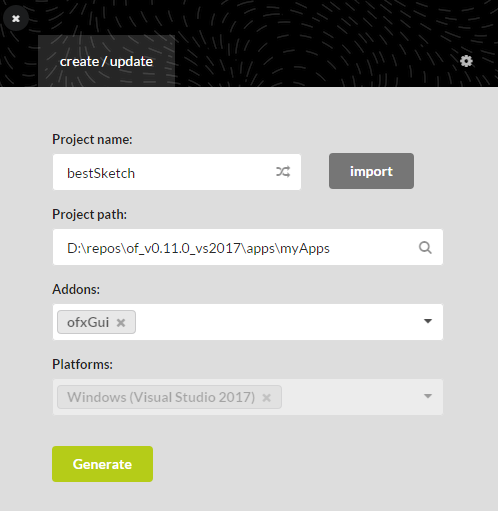

<!-- prettier-ignore-start -->

# Getting Started
{: .no_toc }

[openFrameworks](https://openframeworks.cc) is an open source toolkit designed for creative coding originally created by [Zach Lieberman](http://thesystemis.com/), [Theo Watson](https://theowatson.com/), [Arturo Castro](https://arturocastro.net/), and other members of the openFrameworks community.

openFrameworks is written in C++ and built on top of OpenGL (and [a handful of other libraries](https://openframeworks.cc/about/)). Programs written using openFrameworks run on Microsoft Windows, macOS, Linux, iOS, Android, and Emscripten (Web).

openFrameworks is used by computational artists worldwide to create and inspire.


## Table of Contents
{: .no_toc }

1. TOC
{:toc}

<!-- prettier-ignore-end -->

## Installing openFrameworks

In this course we'll be using the Windows version of openFrameworks for Microsoft's Visual Studio.

To begin you should [download the visual studio (2017) version of the framework here](https://openframeworks.cc/download/), and unzip it to folder on your machine.

You will also need to have the [Community Edition of Visual Studio](https://visualstudio.microsoft.com/vs/community/) installed, with the following "workloads" configured:

- Desktop Development with C++
- Universal Windows Platform Development
- Game Development with C++

## Creating a New Project

{: .medium .inline}

openFrameworks includes a project generator in the `projectGenerator-vs` folder. This is a stand-alone application that will build your initial Visual Studio project for you.

When you first run the project generator, click the gear icon and specific the folder where openFrameworks has been unzipped. This will ensure the `Project Path` is set properly.

For example, if the oF path is `D:\repos\of_v0.11.0_vs2017` then the `Project Path` will start with `D:\repos\of_v0.11.0_vs2017\apps\myApps`.

The project generator can also add additional "Addon" libraries to your project.

## Folder Structure

Here's a brief overview of the important folders in a Visual Studio openFrameworks project:

- Project Root: Visual Studio Solution and Project Files.
- `src/`: Your `.cpp` and `.h` files.
- `bin/`: Your debug and release executables and required `.dll` libraries.
- `bin/data`: Any data files required by your application.

## Hello World Using openFrameworks

Use the project generator to create a new oF project called `helloOpenFrameworks` with no additional "Addons" specified. Once the project is created, hit the `Open in IDE` button to open it in Visual Studio.

On opening the project Visual Studio should prompt you to "Retarget Projects" to the latest installed version of the Windows SDK and Platform Toolset. Click OK. If this doesn't happen automatically, you can force the conversion by going to the `Project` menu and selecting `Retarget Solution`.

Next, ensure that the `Solutions Platforms` dropdown is set to `x64`. You should now be able to build and run the project by clicking on the play button.


Your program should run without errors displaying a grey window.

In the Visual Studio "Solution Explorer" open the `ofApp.cpp` file in the `src` folder, and change the `setup` and `draw` methods to the following:

```cpp
void ofApp::setup() {
    ofSetWindowTitle("Hello openFrameworks!"); // Set the window title.
    ofSetWindowShape(510, 255); // Set the width and height of the window.
    ofSetCircleResolution(80); // Ensure that circles are smooth.
}

void ofApp::draw(){
    // Set the red and blue component of the logo color using the mouse position.
    ofSetColor(255 - ofGetMouseX() / 2, 0, 255 - ofGetMouseY());
    // Draw the oF logo using a circle, two rectangles, and a triangle.
    ofDrawCircle(145, 128, 118);
    ofDrawRectangle(269, 10, 103, 237);
    ofDrawRectangle(377, 117, 61, 61);
    ofDrawTriangle(377, 10, 377, 111, 479, 10);
}
```

Run the program again and you should be presented with the openFrameworks logo. Hover your mouse over the logo to change the color. 😊

## Setup / Update / Draw

At the heart of every openFrameworks application are the `setup`, `update` and `draw` methods.

- `ofApp::setup()` is run once at the start of the program and never again.
- `ofApp::update()` is run once per frame, allowing us to update the state of our application.
- `ofApp::draw()` is run once per frame (after `update`) and should include all graphical output.

The speed at which oF will attemp to call the `draw` method is controlled by setting the target framerate by calling `ofSetFrameRate()` in `setup`.

### Resources

- 📜 [`ofGetFrameNum()`](https://openframeworks.cc//documentation/application/ofAppRunner/#!show_ofGetFrameNum) - Number of frames displayed since the sketch began.
- 📜 [`ofGetElapsedTimeMillis()`](https://openframeworks.cc//documentation/utils/ofUtils/#!show_ofGetElapsedTimeMillis) - Number of milliseconds since the sketch began.
- 📜 [`ofGetLastFrameTime()` Documentation](https://openframeworks.cc//documentation/application/ofAppRunner/#!show_ofGetLastFrameTime) - The delta time since the previous frame in milliseconds.
